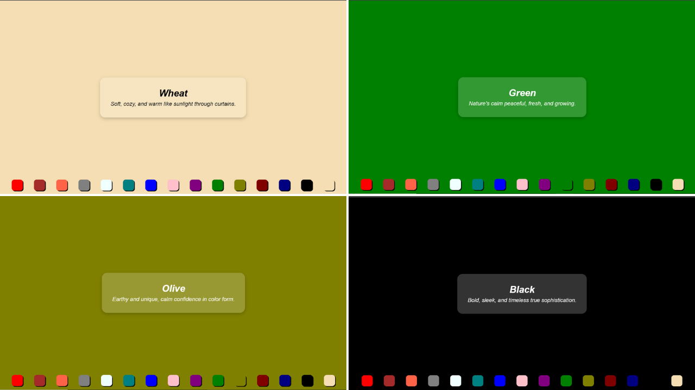

[Overview](#overview)

 [Live Demo](#live-demo)

 [Features](#features)

 [Tech Stack](#tech-stack)

 [What I learned](#what-i-learned)

#  Overview

A simple and responsive Background Color Changer built using React, Vite, and CSS.  
This app allows users to switch between multiple colors. When user switch to a different color, color's name and a short description appears on scree.

##  Live Demo

 [View Live Project] (https://ayeshalatif1.github.io/backgroundColorChanger//)

##  Features

-  Real-time color changer    
-  Clean and responsive user interface  
-  Built with Vite for fast development and build times  

##  Tech Stack

- React – Frontend library  
- Vite – Lightning-fast build tool  
- CSS – For styling and layout   

##  Preview

##  What I Learned

- How to build a project using React with Vite 
- How to manipulate objects to extract required information 
- How to manage state using useState hook 
